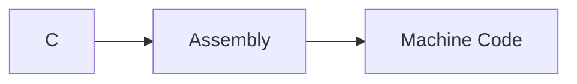

````c
#include <stdio.h>

int main(){
        printf("Hello World");
        return 0;
}
````

The above code prints hello world on our terminal.
It consists of 3 parts:
- First it's including the libraries, in this case, the stdio.h library. <#include <stdio.h>, that is being imported from path: /usr/include/stdio.h
- Then it's creating the main function using <int main()> ((Entry Point to our program))
- Then we are printing Hello World using <printf("Hello World")>
- <return 0> is used to send the exit code, in this case, 0 is for successful execution, if it's -1, it will throw an error despite successful execution of the code. 

To create an executable file in linux we will use gcc compiler. 
````bash
gcc hello.c
````

where, hello.c is the name of the file. 

The executable file is a file that is written in machine code, this is an example of how it appears to be. 


to view this image properly, we are going to use hexedit, a hex editor


When we do 
````bash
ls -la
````
we notice that the size of the executable file is bigger than the size of our original, hello.c file. 

now, if we want to view our code, or the executable file in machine code or rather assembly code we can do so by using:
````bash
gcc -S hello.c
````
It will create a file hello.s, and when you open it, you will see something like this:
![[Intermediate Code = Assembly Code.png]]

So, basically how it works is like this:
- First we write the C code. 
- Then with the use of gcc, it is converted into assembly in the intermediate step. 
- Then at the end it is converted to machine code. 


We can create functions in c and then later call them in the main function, which is the entry point for a program for a c program. 
```C
#include <stdio.h>  
int hello(){  
       printf("Welcome to VOID-DOMAIN");  
}  
  
int main(){  
       printf("Hello World \n");  
       hello();  
       return 0;  
}
```
 - From { to } is known as function definition. 
NEXT –> [[Basic Syntax & Formatting]]


