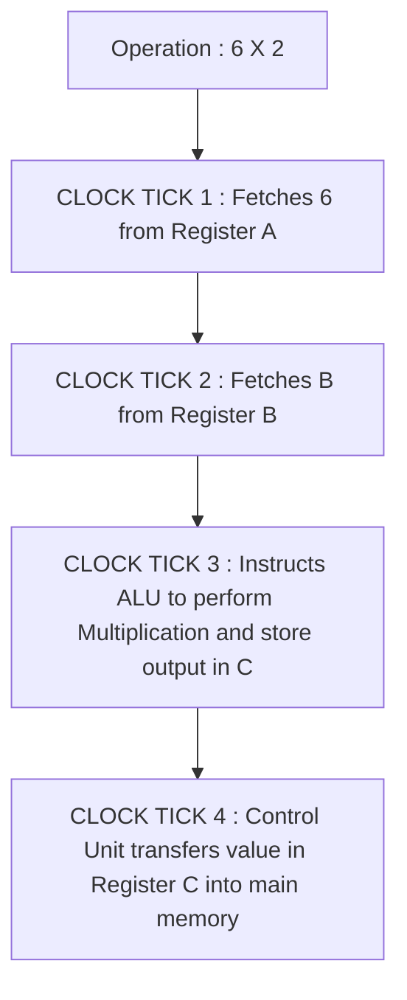

# CPU Architecture
![[CPU Architecture.svg]]
For our first generation of neural network we will be creating CPU networks. 
## What is a CPU
##### What is CPU made of?
- Registers : Memory Locations ( Basically )
- ALU - Arithmetic Logical Unit : To perform arithmetic operations on Numbers ( kind of ties two numbers together in gist)
- Clock : Every Operations Makes the Clock Tick. 
- Buses : 
	- Data Bus : 
		- Responsible for transferring data from one location to another. 
	- Address Bus :
		- Responsible for Bussing Addresses from one location to another
	- Control Bus : 
		- Responsible for Busing Control Addresses from one location to another. 
- Control Unit : Decides in what order the operations will be executed, and where the data will flow. 
- Cache :  Quick Access Memory

### Process Breakdown
Eg: 
— 6 X 2
- CLOCK TICK 1: 
	- Control Unit fetches the first value (6) from memory and stores it in Register A. 
- CLOCK TICK 2:
	- Control Unit fetches the second value (2) from memory and stores it in Register B. 
- CLOCK TICK 3: 
	- Control Unit instructs ALU to perform Multiplication on values stored in Register A & B and store the result in Register C. 
- CLOCK TICK 4: 
	- Control Unit Transfers value in Registers C into the main memory. 

#### What is CPU made of? 
– Transistors. Rather, MOSFET ( metal-oxide-semiconductor field-effect transistor ) Transistors. (( They are the most manufactured product humans have ever made ))
#### What is a transistor?
There are 3 parts of transistors:
- Base
- Collector
- Emitter

| IN | OUT |
|:---|:----|
|  0 |   0 |
|  1 |   1 |  

0 → 4.5 V → High Voltage
1 → 1.5 V → Low Voltage
When there’s low voltage flowing through the base, current won’t flow between the collector and the emitter. 
When there’s high voltage flowing through the base, current is allowed to flow into the collector. As long as current is flowing into the collector, it will flow into the emitter, hence it will be the output. 

- In the image above, there are 3 transistors interconnected with each other. 
- The output from the first transistors takes place as the input for the input voltage for the third transistor. 
- The output from the second transistor is going to be used as continuous current voltage for the third transistor. 

| IN1 | IN2 | OUTPUT |
|:---:|:---:|:------:|
|   0 |   0 |      0 |
|   1 |   0 |      0 |
|   0 |   1 |      0 |
|   1 |   1 |      1 |  
The above table is truth table. AND GATE TABLE. 

Low → base, Low → collector –> output → low
High → base, Low → collector –> output → low
Low → base, High → collector → emitter –> output → low
High → base, High → collector → emitter –> output → high

#### Why do computers count in binary? 
- Because they are made of transistors and transistors have two states, 0 & 1, basically false and true, so the binaries send different kinds of signals to the system, and then we are able to perform the operations using different activated transistors. 
- Out of transistors we built logic gates, then complex logic gates, then computing devices.
